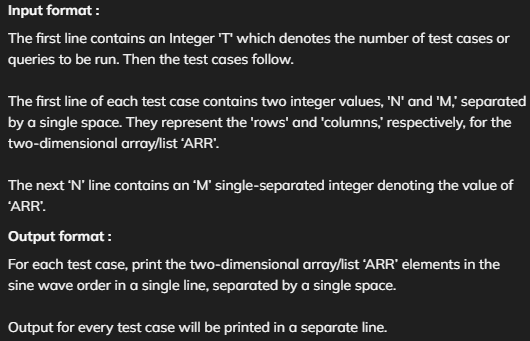

#  Print Like A Wave

### Problem statement
```
For a given two-dimensional integer array/list ‘ARR’ of size (N x M), print the ‘ARR’ in a sine wave order, i.e., print the first column top to bottom, next column bottom to top, and so on.

For eg:-

The sine wave for the matrix:-
1 2
3 4
will be [1, 3, 4, 2].

```

### Detailed explanation ( Input/output format, Notes, Images )


### Constraints :
```
1 <= T <= 10
1 <= N <= 100
1 <= M <= 100
0 <= ARR[i][j] <= 100
```

#### Time Limit: 1sec

### Sample Input 1:
```
2
3 4
1 2 3 4
5 6 7 8
9 10 11 12
4 4
1 2 4 5
3 6 8 10
11 12 13 15
16 14 9 7
```

### Sample Output 1:
```
1 5 9 10 6 2 3 7 11 12 8 4
1 3 11 16 14 12 6 2 4 8 13 9 7 15 10 5 
```

#### Explanation For Sample Input 1:
```
Here, the elements are printed in a form of a wave, first, the 0th column is printed from top to bottom then the 1st column from bottom to top, and so on. Basically, the even column is printed from top to bottom and the odd column in the opposite direction.

```

### Sample Input 2:
```
2
1 1
3
1 2
6 5
```

### Sample Output 2:
```
3
6 5 
```

## Java Solution
### Approach 1 
```
import java.util.* ;
import java.io.*; 

public class Solution {
	public static int[] wavePrint(int arr[][], int nRows, int mCols) {
		// Write your code here.
		int[] ans = new int[nRows * mCols];
		int idx = 0;
		for(int col = 0; col < mCols; col++ ) {
			if(col % 2 == 0) {
				for(int row=0; row<nRows; row++) {
					ans[idx++] = arr[row][col];
				}
			} else {
				for(int row=nRows-1; row>=0; row-- ) {
					ans[idx++] = arr[row][col];
				}
			}
		}

		return ans;
	}
}

```

